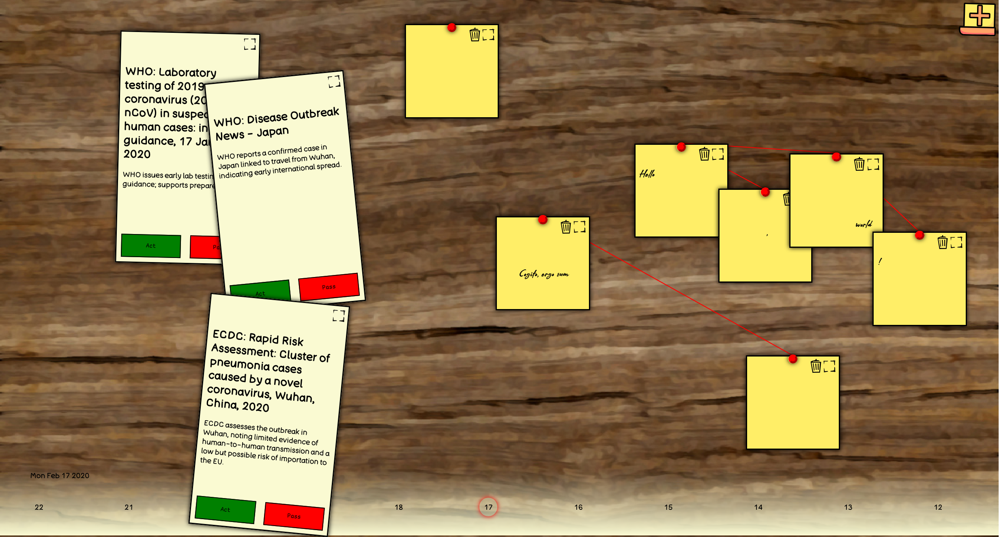
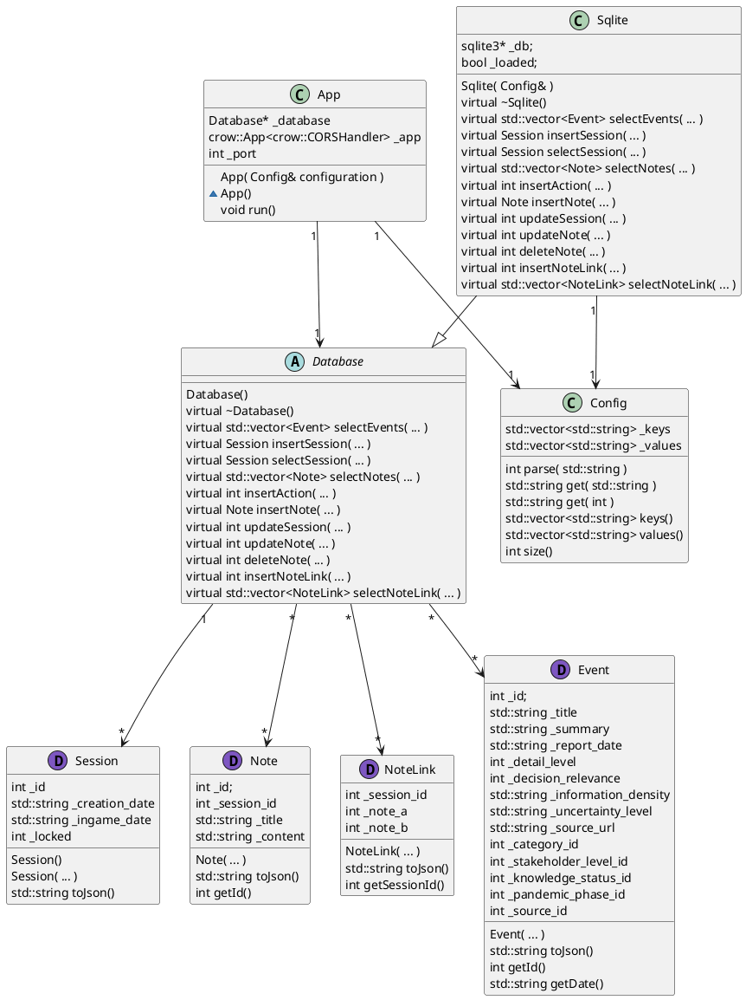
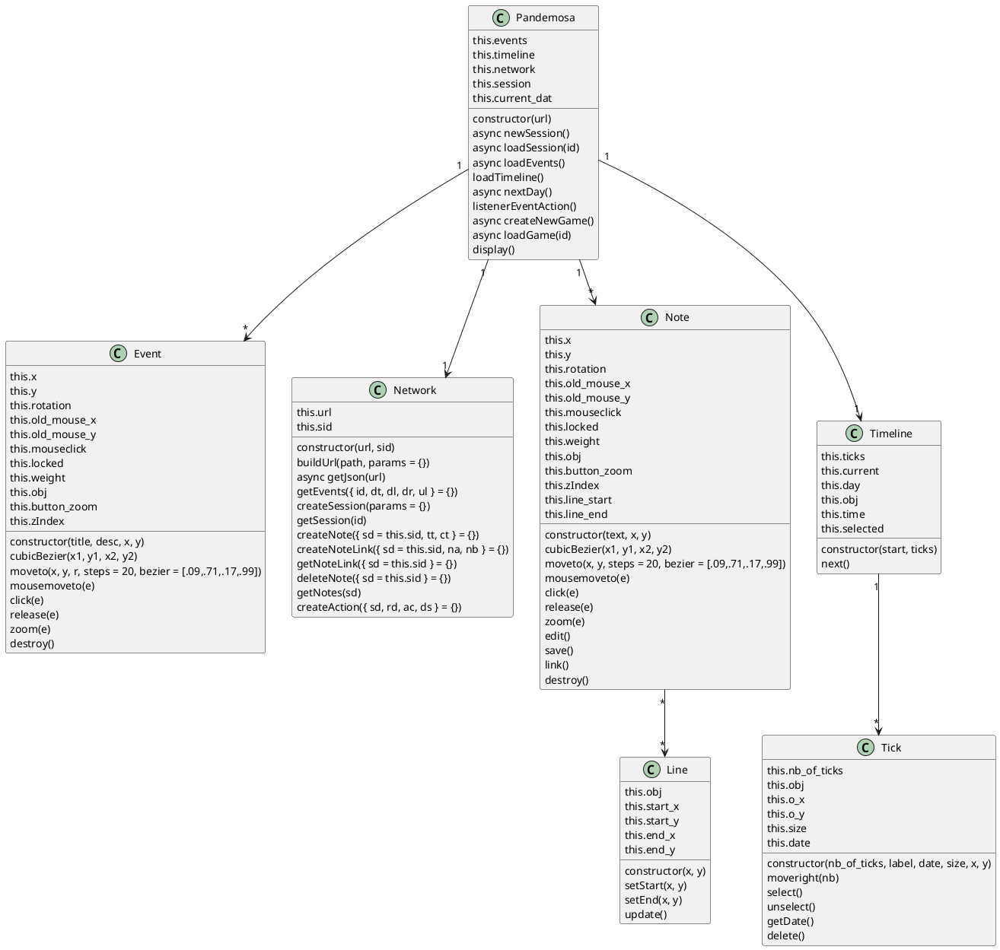
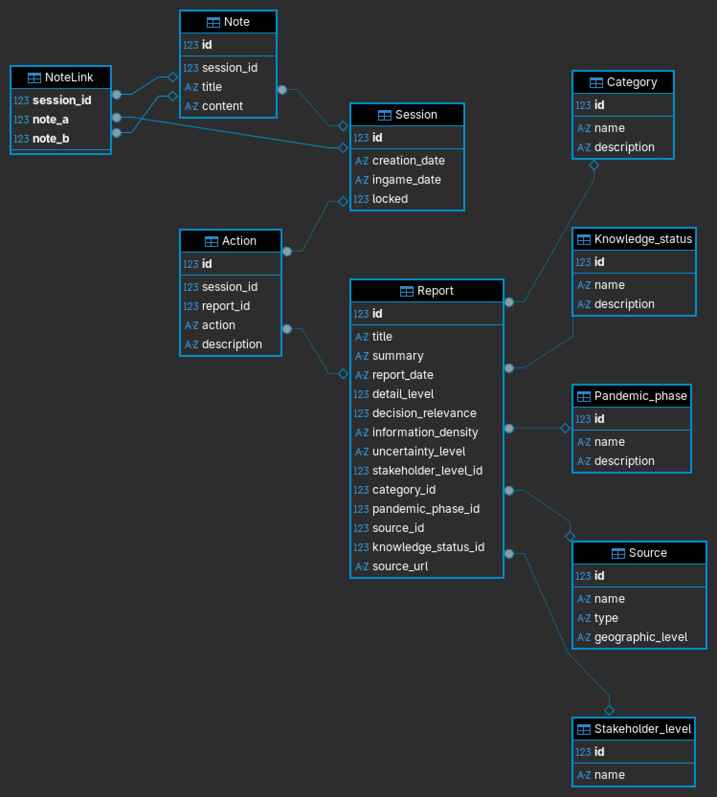

# Pandemosa

Pandemosa is a pandemic simulation game made by the GECKO institute. 

It work with C++, HTML, CSS and JavaScript. It use the CrowCpp framework, SQLite3 and standard C++ libraries and no JS or CSS framework.

# Build/Usage

CrowCpp need libasio to compile.

```bash
$ git clone https://github.com/j04chim/GECKO_Pandemosa.git
$ cd GECKO_Pandemosa
$ mkdir build && mkdir doxygen
$ ln -s www/static build/static
$ ln -s www/templates build/templates
$ cmake .
$ make
```

``add_definitions(-DLOG_LEVEL=0)`` can be modified in ``CMakeLists.txt`` to change the log level.

The executables are located in the build folder. `Kausjan` start the server and `Kausjan_test` start the test suit.
A config file using the following format is required:
```bash
port=8080
driver=sqlite
database=path_to_database
url=http://127.0.0.1:8080/
```
``config_template`` contain example configuration.

# Notes

No IA was used to generate code, assets, or any part of this project. Fonts are joined with their copyright (Open Font License) in text format. ``table.jpg`` is an image from the public domain with mean curvature blur applied to it. All the other images and assets were made by me, except for the GECKO institute logo, and belong to the public domain.

Only something like 1% of the code has tests, expect bugs and unreliable behaviors.

# Images

## UI
### First draft of the UI:


### Current UI:


## Roughtly how everything organize
### Server


### Web-application


### Database
