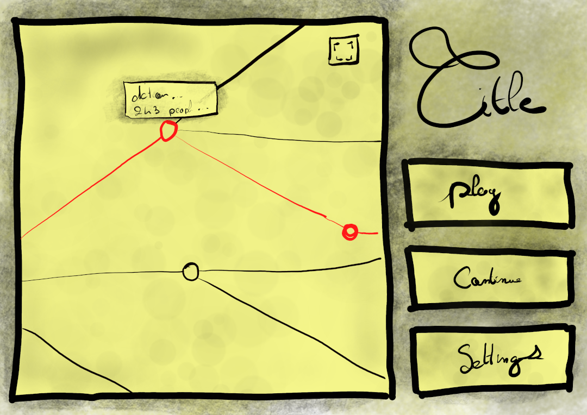
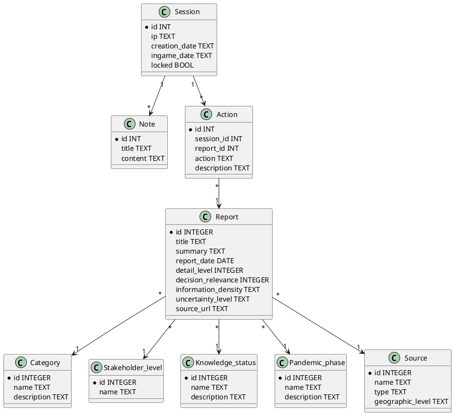

# Pandemosa

Pandemosa is a pandemic simulation game made by the GECKO institute.

# Build/Usage

```bash
$ git clone [url]
$ cd GECKO_Pandemosa
$ mkdir build && mkdir doxygen
$ cmake .
$ make
```

The executables are located in the build folder. `Kausjan` start the server and `Kausjan_test` start the test suit.
A config file using the following format is required:
```bash
port=8080
driver=sqlite
database=path_to_database
```

The API has the following routes:
- `/getEvents` return a list a events matching parameters
- `/createSession` create a session and return it
- `/getSession` return a session with the given id
- `/createNote` create note linked to a session
- `/getNotes` return all the notes of a session
- `/createAction` save a player action

# UI

wip



